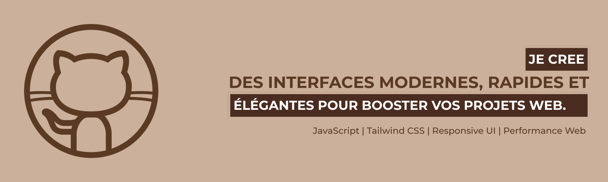

# <h1 align="center"> 👋 Salut, je suis <b>Jules Mukadi</b> !</h1>

## <h3 align="center"><b>🚀 À propos de moi</b></h3>
Je suis un **développeur web passionné** originaire de la **République Démocratique du Congo CD**, spécialisé dans :
- 🌐 **Développement web** (HTML, CSS, JavaScript, PHP, Bootstrap, React)
- 🖥️ **Développement backend** (Node.js, PHP, MySQL, Ruby on Rails)

---

## <h3 align="center"><b>🛠️ Technologies & Outils </b>  </h3>
Voici quelques-unes des technologies et outils avec lesquels j'aime travailler :

- **Frontend** :   

- **Backend** :   

- **Bases de données** :  
- **Outils** :   

- **Frameworks** :   

---

## <h3 align="center"><b>💼 Projets en cours </b> </h3>
Voici quelques projets sur lesquels je travaille actuellement :

- **📚 Système de gestion scolaire** : Une application web pour gérer les étudiants, les enseignants et les paiements.
- **🚗 Voiture RC contrôlée par Bluetooth** : Un projet basé sur Arduino pour contrôler une voiture RC via Bluetooth.
- **🌐 Portfolio de développeur** : Un site portfolio pour présenter mes travaux et projets.

---

## <h3 align="center"> <b>📊 Statistiques GitHub</b> </h3>

  

 

---

## <h3 align="center"> <b>🏆 Trophées GitHub </b> </h3>

  

## <h3 align="center"> <b>🌍 Restons en contact !</b> </h3>

  
  
  
  
  
  

<!-- Séparateur personnalisé en bleu -->

<!-- Centrer et réduire l'image du pied de page -->

  

