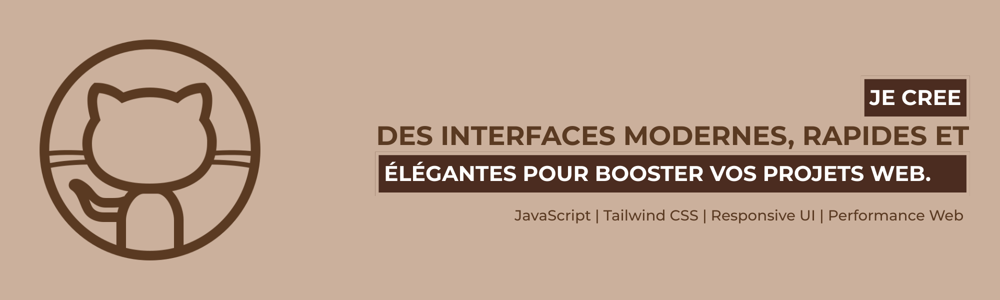

<!-- - 👋 Hi, I’m @2MJ-DEV
- 👀 I’m interested in ...
- 🌱 I’m currently learning ...
- 💞️ I’m looking to collaborate on ...
- 📫 How to reach me ...
- 😄 Pronouns: ...
- ⚡ Fun fact: ... -->

<!---
2MJ-DEV/2MJ-DEV is a ✨ special ✨ repository because its `README.md` (this file) appears on your GitHub profile.
You can click the Preview link to take a look at your changes.
--->
# 👋 Salut, je suis **Jules Mukadi** !

## 🚀 À propos de moi
Je suis un **développeur logiciel passionné** originaire de la **République Démocratique du Congo CD** , spécialisé dans :
- 🌐 **Développement web** (HTML, CSS, JavaScript, PHP, Bootstrap)
- 🖥️ **Développement backend** (Node.js, PHP, MySQL)
- 🤖 **Projets IoT** (Arduino, Bluetooth)

J'ai obtenu un **diplôme en Génie Logiciel** 🎓 à l'**Université Protestante de Lubumbashi** 🏛️.

---

## 🛠️ Technologies & Outils
Voici quelques-unes des technologies et outils avec lesquels j'aime travailler :

- **Frontend** :   
- **Backend** :   

- **Bases de données** :  
- **Outils** :   

- **Frame-work** :    

---

## 💼 Projets en cours
Voici quelques projets sur lesquels je travaille actuellement :

- **📚 Système de gestion scolaire** : Une application web pour gérer les étudiants, les enseignants et les paiements.
- **🚗 Voiture RC contrôlée par Bluetooth** : Un projet basé sur Arduino pour contrôler une voiture RC via Bluetooth.
- **🌐 Portfolio de développeur** : Un site portfolio pour présenter mes travaux et projets.

---

## 🌍 Restons en contact !
Tu peux me retrouver sur :
- 
- 
- 

---

